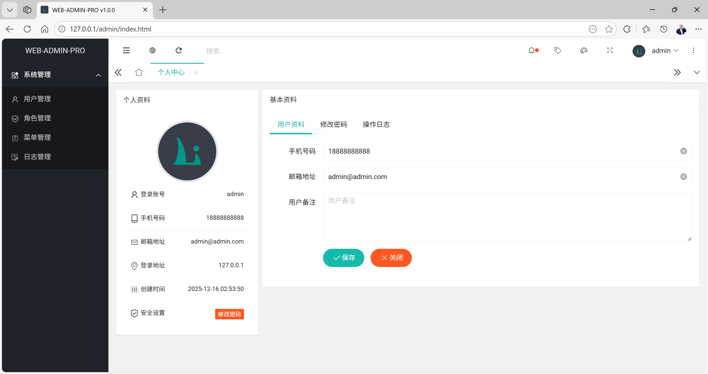

<h1 style="text-align: center">WEB-ADMIN-PRO 后台管理系统</h1>

#### 项目简介
一个基于 SpringBoot 3.5.8、SpringBoot Jpa、Spring Session、Thymeleaf 的后台管理系统

#### 前端框架
最新版[AdminUI](https://gitee.com/znn1980/admin-ui-pro)主题

####  系统功能
- 用户管理：提供用户的相关配置
- 角色管理：对权限与菜单进行分配
- 菜单管理：支持多级菜单
- 系统日志：记录用户操作日志与异常日志

