<h1 align="center" style="margin: 30px 0 30px; font-weight: bold;">WEB-ADMIN-PRO 后台管理系统</h1>
<h4 align="center">基于 Java 21、Spring Boot 3.5.x、Spring Data JPA、Spring Session、Thymeleaf 的后台管理系统。</h4>
<p align="center"></p>

## 前端框架
最新版《[AdminUI](https://gitee.com/znn1980/admin-ui-pro)》主题。（注：iframe版不涉及最新的前端技术，对服务端程序员来说非常友好）

## 系统功能
- 用户管理：提供用户的相关配置，新增用户后，默认密码为手机号码后六位。
- 角色管理：对角色菜单权限分配。
- 菜单管理：实现访问地址级的菜单配置，操作权限，支持多级菜单。
- 系统日志：记录用户操作日志与异常日志。
- 个人中心：个人信息、密码、日志的查看与修改。
- 通知公告：系统通知公告信息发布维护。
- 服务监控：监视当前系统、内存、磁盘等相关信息。

## 许可证
系统启动后会生成《key.txt》文件，使用如下方法生成《key.lic》文件。
```
//读取许可证编号
String licenseNumber = Files.readString(Paths.get("key.txt"));
//生成许可证文件
Files.write(Paths.get("key.lic")
    , SysLicense.asSysLicense(new SysLicense(licenseNumber
        //许可证有效期
        , LocalDate.now(), LocalDate.of(2037, 1, 1))));
```

## 项目捐赠
> 项目的发展离不开你的支持，请作者喝杯咖啡吧☕  
<table>
    <tr>
        <td></td>
        <td></td>
    </tr>
</table>

## 项目演示
<table>
    <tr>
        <td></td>
        <td>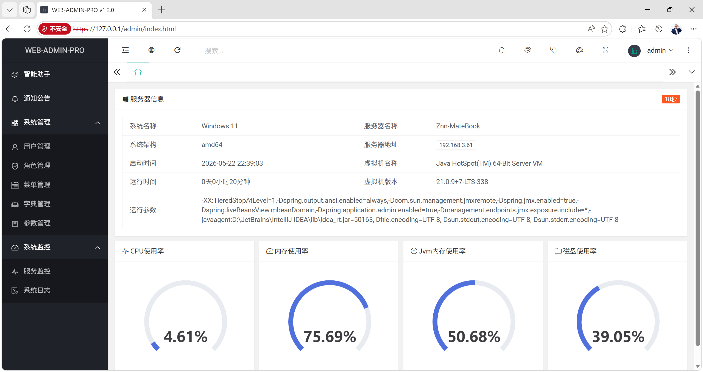</td>
        <td>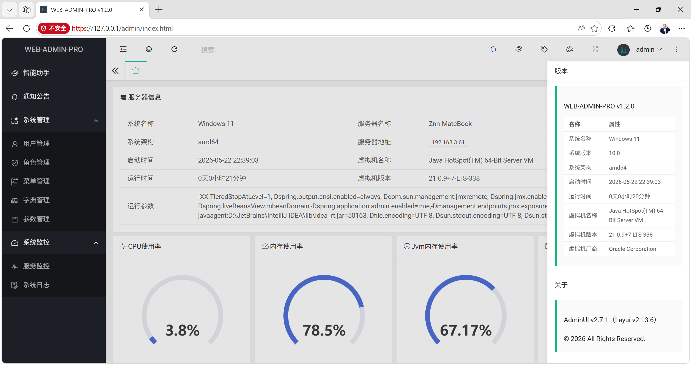</td>
    </tr>
    <tr>
        <td>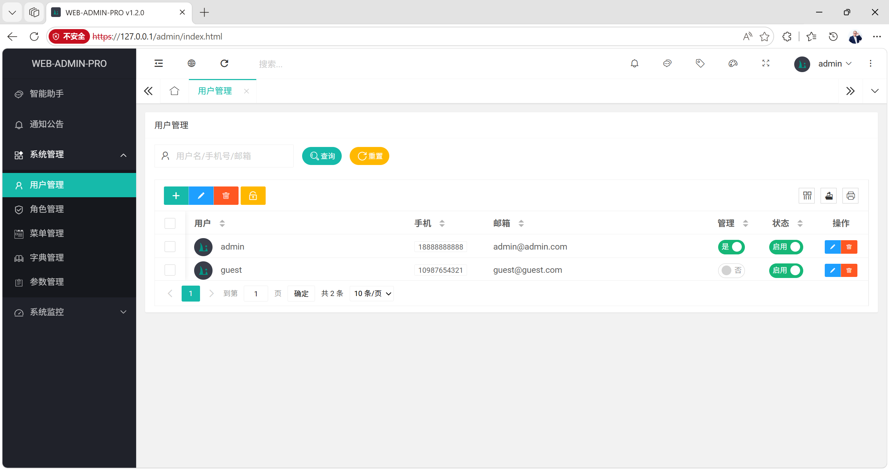</td>
        <td>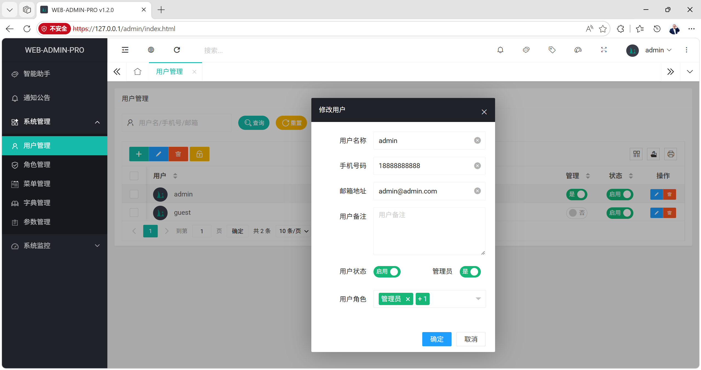</td>
        <td></td>
    </tr>
    <tr>
        <td>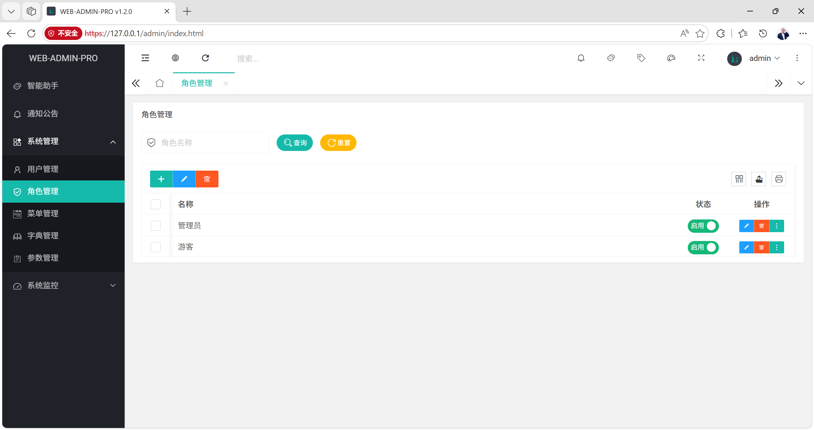</td>
        <td>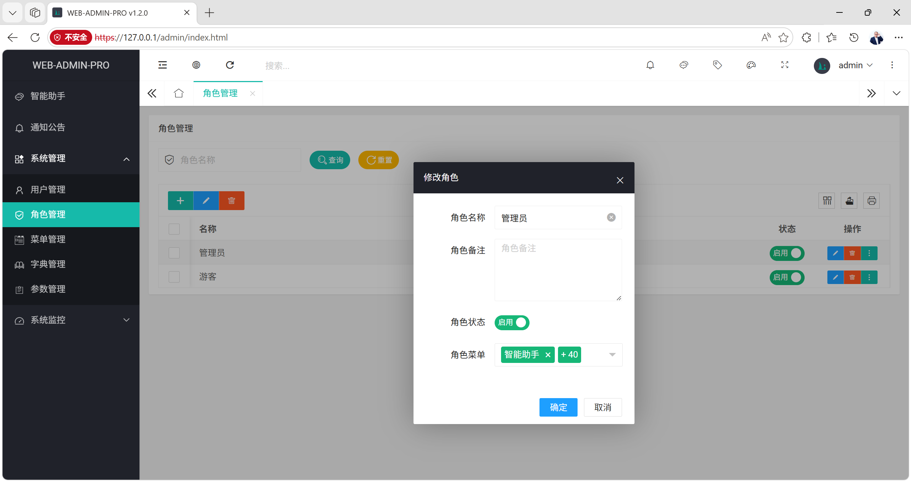</td>
        <td></td>
    </tr>
    <tr>
        <td>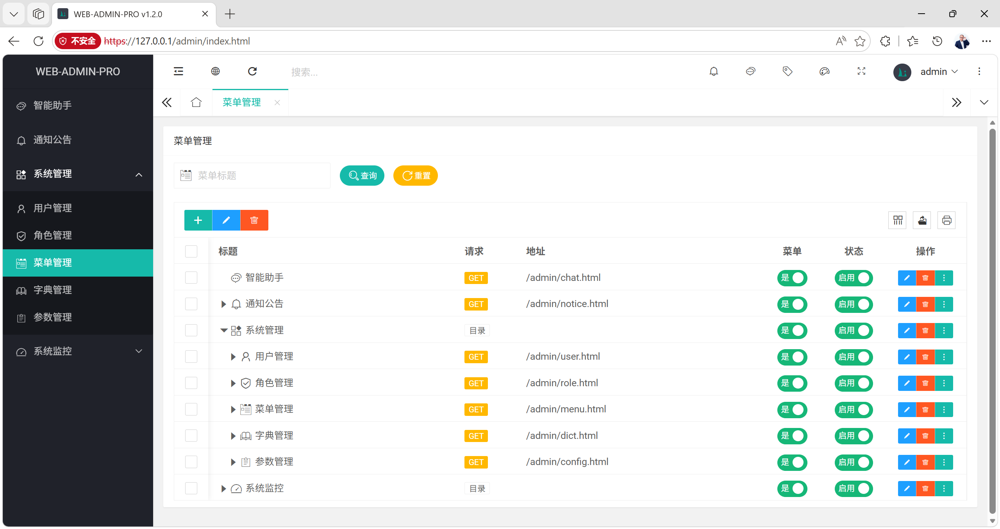</td>
        <td>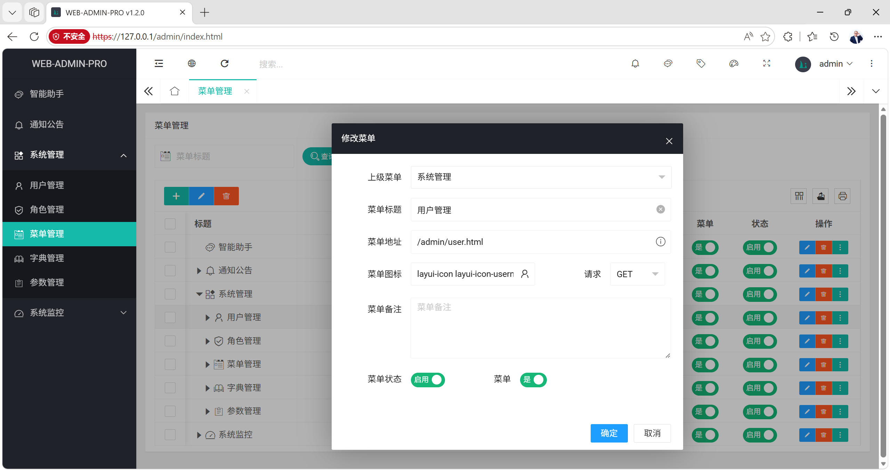</td>
        <td></td>
    </tr>
    <tr>
        <td>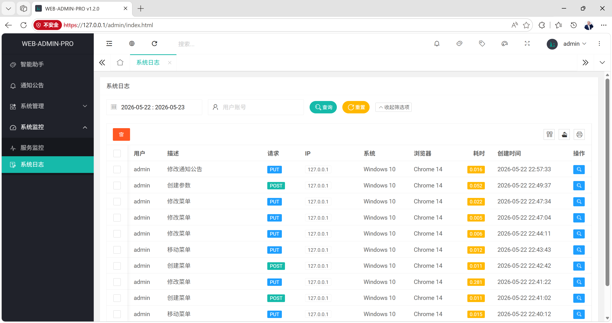</td>
        <td>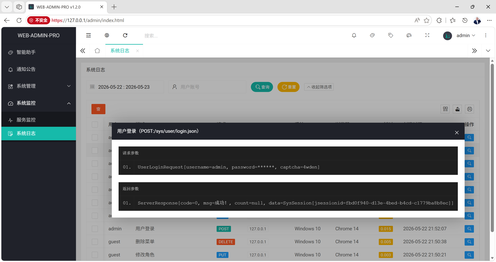</td>
        <td></td>
    </tr>
    <tr>
        <td>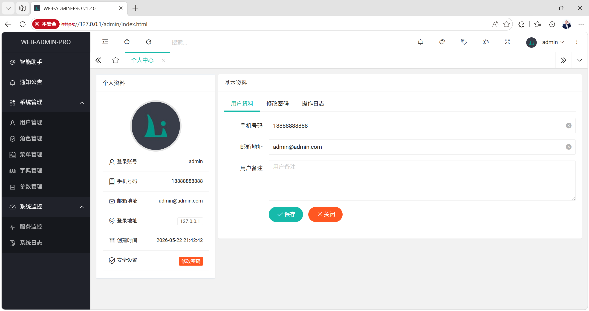</td>
        <td>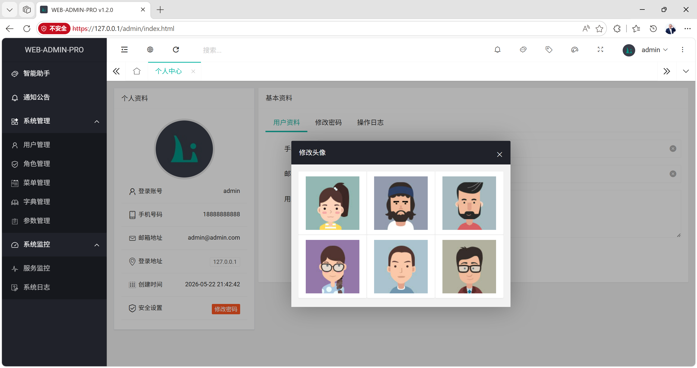</td>
        <td></td>
    </tr>
    <tr>
        <td>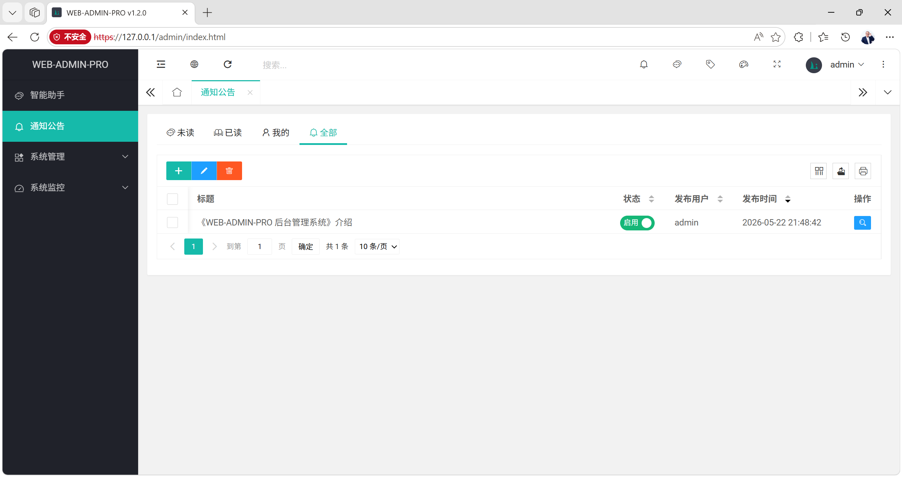</td>
        <td>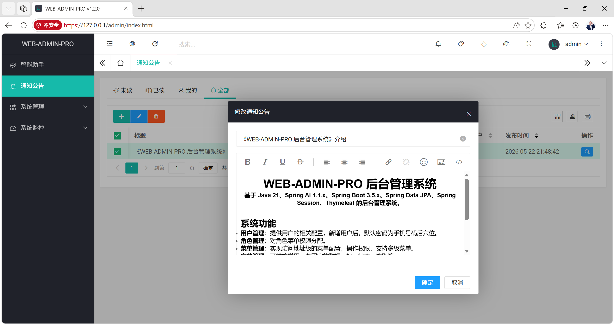</td>
        <td>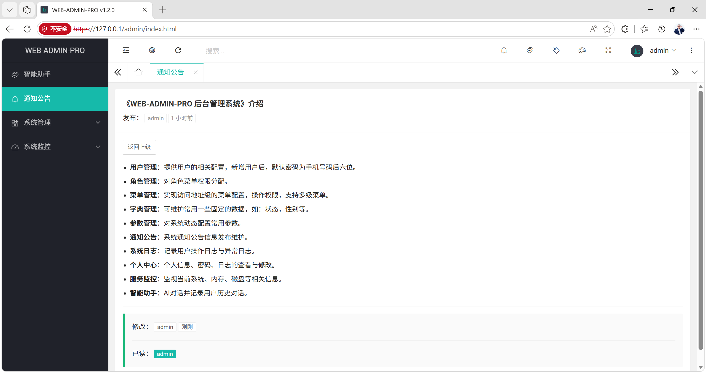</td>
    </tr>
    <tr>
        <td>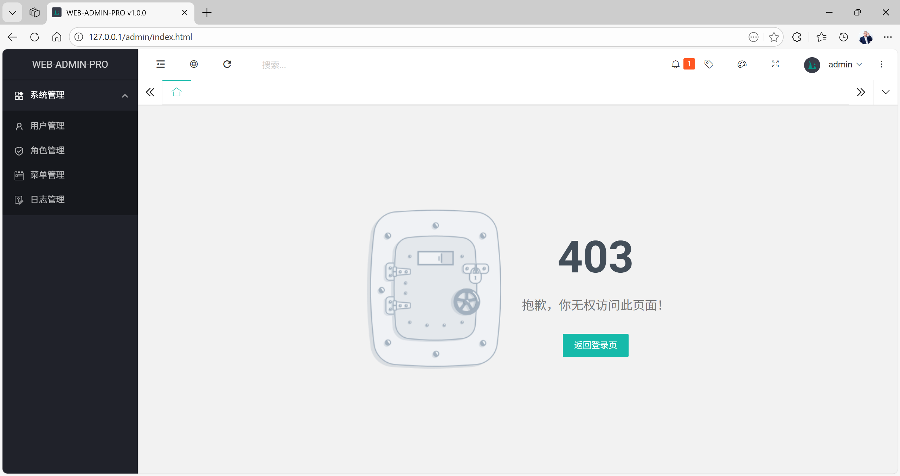</td>
        <td>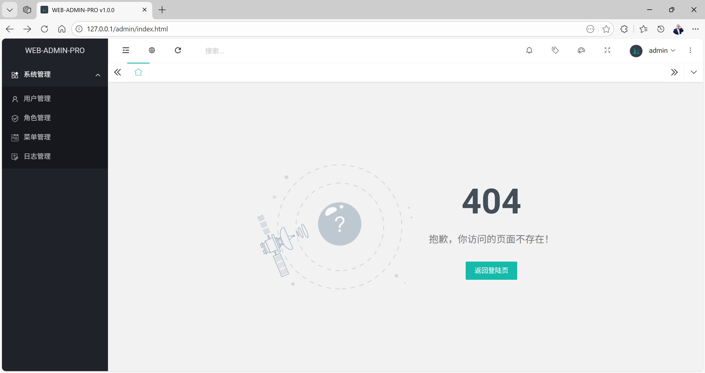</td>
        <td>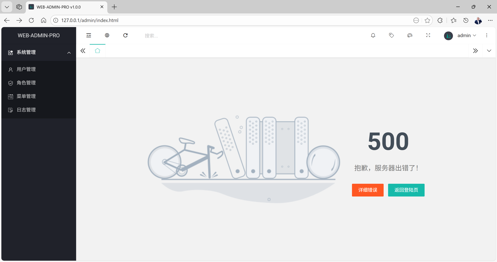</td>
    </tr>
</table>